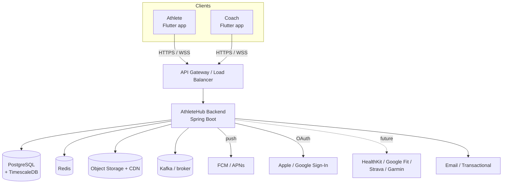
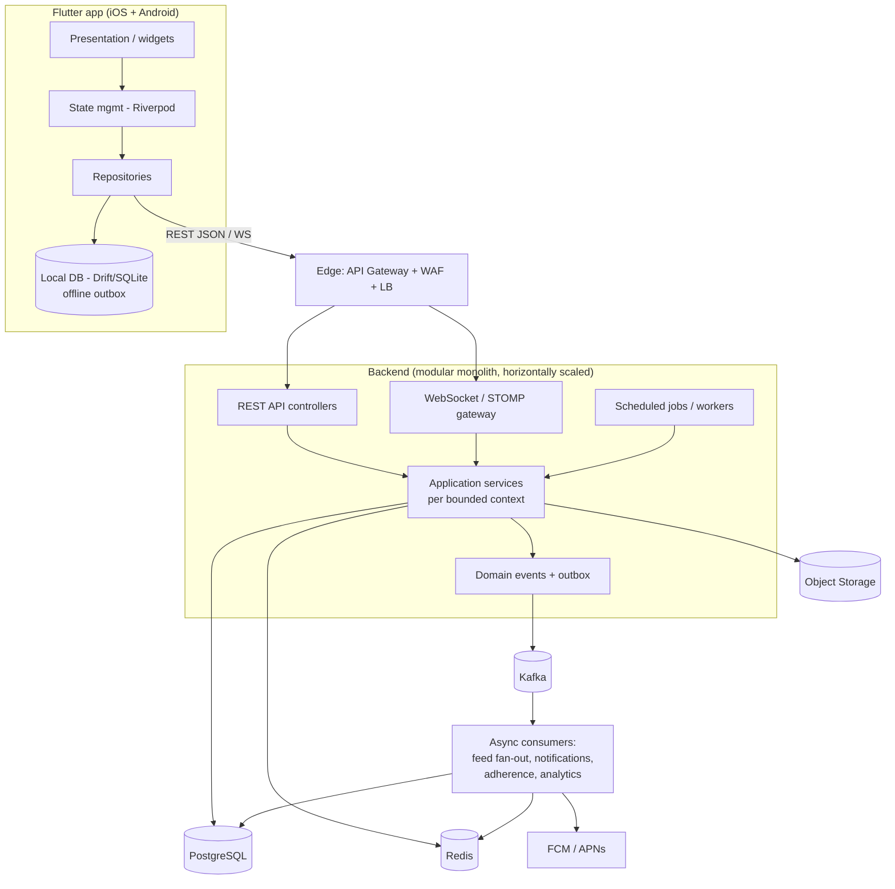
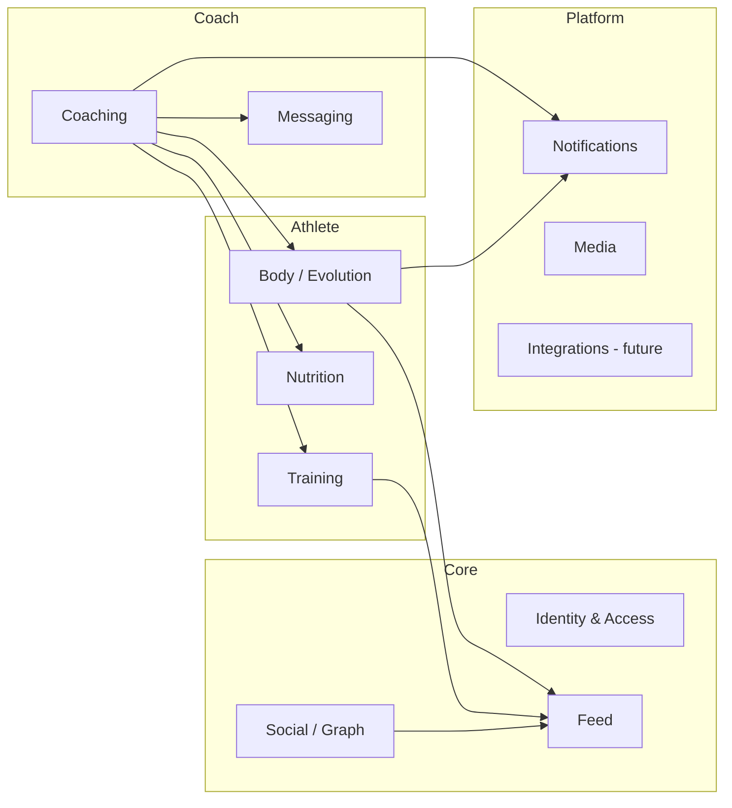
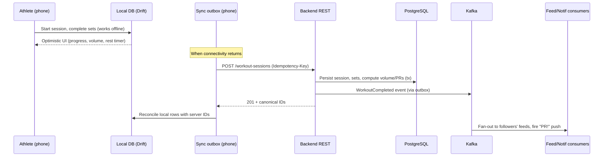
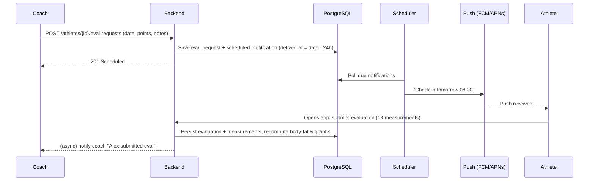
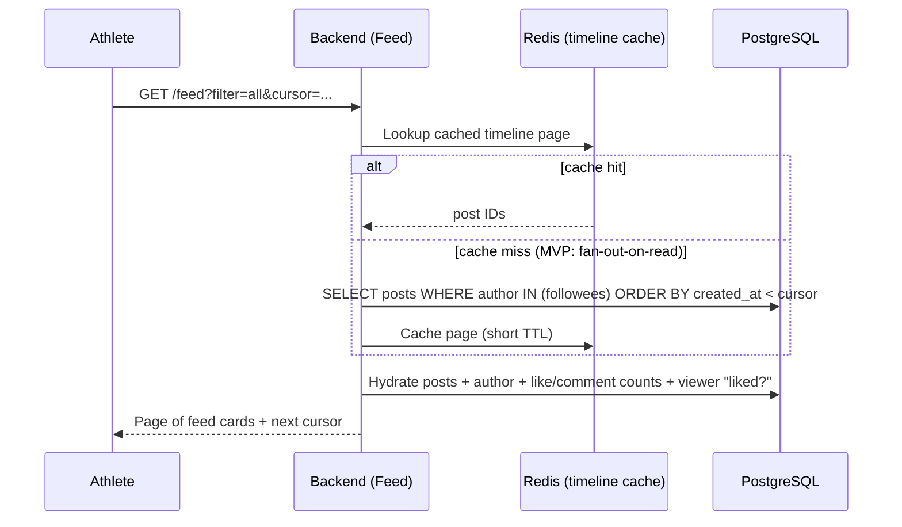

# 01 · System Overview

## 1. Context (who talks to AthleteHub)

Athletes and coaches use the **same Flutter app** in different modes (the design
switches `role` between `student` and `teacher`). There is no separate coach
client at launch.

## 2. Containers (the deployable pieces)

### Container responsibilities

| Container | Responsibility |
|---|---|
| **Flutter app** | All UI, offline workout/eval logging, optimistic updates, local cache, sync engine, push handling |
| **Edge (Gateway/LB/WAF)** | TLS termination, routing, rate limiting, auth token check, request size limits |
| **Backend (Spring Boot)** | Business logic for all bounded contexts, persistence, event publication, realtime fan‑out |
| **Async consumers** | Run inside the same deployable for MVP (Spring `@KafkaListener` / `@Async`); extracted to separate workers as volume grows |
| **PostgreSQL** | System of record for all durable state |
| **Redis** | Refresh‑token store, cache, rate‑limit counters, feed timeline cache, presence, rest‑timer coordination |
| **Object storage + CDN** | Media (progress photos, evolution images, coach branding, exports) |
| **Kafka** | Durable async backbone between contexts |

## 3. Bounded contexts (the modules)

These map 1:1 to the screens in the design and to backend modules
([03-backend](03-backend.md)) and DB schemas ([02-data-model](02-data-model.md)).

| Context | Screens it powers |
|---|---|
| **Identity & Access** | Sign in / sign up, OAuth, role switch, account, password reset |
| **Social / Graph** | Find people, follow/unfollow, suggestions, profile header counts |
| **Feed** | Activity feed, filters, likes, comments, share |
| **Training** | Train tab, live workout session, cardio log, recent sessions, PRs |
| **Body / Evolution** | Evolution tab, new evaluation (manikin), graph detail, evaluations history |
| **Nutrition** | Diet tab, macro ring, meals, add food, food DB, daily diary, day strip |
| **Coaching** | Students dashboard, student detail, assign workout/diet/eval, schedule, library, coach profile, adherence/flags |
| **Messaging** | Coach inbox, athlete↔coach threads |
| **Notifications** | Push (eval reminders, "notify student"), in‑app notifications |
| **Media** | Photo upload/processing, signed URLs |
| **Integrations** *(future)* | HealthKit / Google Fit / Strava / Garmin sync for HR, power, runs |

## 4. End‑to‑end flows

### 4.1 Logging a workout (offline‑capable, the hardest path)

Key points: the **rest timer and set logging never depend on the network**; the
backend computes the *authoritative* volume/PR numbers; the
`Idempotency-Key` makes a retried POST safe; feed and push happen
**asynchronously** so the save is fast.

### 4.2 Coach assigns an evaluation check‑in

### 4.3 Reading the social feed

The feed starts **fan‑out‑on‑read** (simple, correct, cheap) and moves to
**fan‑out‑on‑write** with a Redis/feed‑store timeline when read volume demands
it — see the scale triggers in [08-roadmap](08-roadmap.md).

## 5. Tech stack summary

**Backend:** Java 21, Spring Boot 3 (Web, Security, Data JPA, Validation),
Spring for GraphQL *(Phase 2)*, Spring WebSocket/STOMP, Resilience4j, Flyway,
Micrometer + OpenTelemetry, Testcontainers.

**Data:** PostgreSQL 16 + TimescaleDB, Redis 7, S3‑compatible storage, Kafka.

**Mobile:** Flutter 3 (stable), Riverpod, go_router, Dio, Drift (SQLite),
freezed + json_serializable, fl_chart, firebase_messaging, flutter_secure_storage.

**Platform:** Docker, Kubernetes *or* Cloud Run/ECS Fargate, GitHub Actions,
managed Postgres/Redis, CDN, secrets manager.
