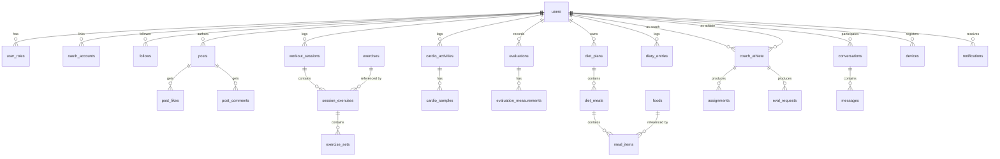

# 02 · Data Model

## 1. Decision: SQL or NoSQL?

> **PostgreSQL is the system of record.** Redis, object storage, and (later) a
> search engine + dedicated feed store handle the jobs Postgres is bad at.
> We do **not** use MongoDB as the primary store.

### Why PostgreSQL, concretely from this design

The AthleteHub domain is **dense with relationships and invariants** that a
document store would force us to re‑implement by hand:

| Evidence in the design | Why it wants a relational model |
|---|---|
| Follow graph, mutual counts, suggestions | Many‑to‑many graph; joins + aggregates |
| Workout → exercises → sets; volume & PR rollups | Nested 1‑many with strong consistency on writes |
| Coach ↔ athlete, assignments, adherence, "needs check‑in" | Relationship + authorization rules ("a coach sees only their athletes") |
| Diet plan → meals → items; targets vs actuals | 1‑many with numeric aggregation |
| Evaluations with 13 circumferences + 8 skinfolds | Consistent, queryable measurement history |
| Likes/comments counts, "did *I* like this?" | Cross‑entity joins per viewer |

These are textbook relational workloads. We also get, for free: ACID
transactions (a workout save is all‑or‑nothing), foreign‑key integrity, and a
mature migration story (Flyway).

PostgreSQL covers the "NoSQL‑ish" needs without a second database **at MVP**:

- **JSONB columns** for genuinely flexible/semi‑structured payloads (feed card
  `stats`/`chart` snapshots, requested eval points, notification payloads).
- **TimescaleDB extension** turns specific tables into time‑series hypertables
  (cardio HR/power/pace samples, body‑metric history) with fast range queries
  and automatic partitioning — without leaving Postgres.
- **Full‑text search** (`tsvector`) for food and people search at MVP scale.

### Where non‑relational stores earn their place (polyglot persistence)

| Store | Job | When |
|---|---|---|
| **Redis** | Refresh tokens/sessions, cache, rate‑limit counters, feed timeline cache, presence, live rest‑timer/session coordination | **MVP** |
| **Object storage (S3) + CDN** | Progress photos, evolution images, coach branding, PDF/CSV exports | **MVP** |
| **OpenSearch / Elasticsearch** | People + food search, feed search once `tsvector` strains | Phase 2, when search latency/relevance demands it |
| **Dedicated feed/timeline store** (Redis sorted sets, or DynamoDB/Cassandra) | Fan‑out‑on‑write home timelines for high‑follower accounts | Phase 2/3, on read‑volume trigger |
| **Document/wide‑column store** (optional) | Chat message history at very high write volume | Phase 3 only if Postgres messaging table becomes hot |

**Bottom line:** "SQL vs NoSQL" is a false binary here. The right answer is
**Postgres‑primary + purpose‑built stores**, introduced on measured triggers,
not upfront.

---

## 2. Schema conventions

- All tables have `id BIGINT GENERATED ALWAYS AS IDENTITY` (or UUID v7 for
  rows synced from clients — see note) plus `created_at`, `updated_at timestamptz`.
- **Client‑generated rows** (workout sessions, sets, evaluations, diary
  entries, messages) carry a **`client_uuid UUID UNIQUE`** so the offline phone
  can create the row locally and the server can dedupe on sync (idempotency).
- Money/decimals use `numeric`; measurements use `numeric(6,2)`.
- Soft delete via `deleted_at timestamptz NULL` on user‑facing content
  (posts, comments) so feeds/threads stay consistent; hard delete on GDPR erase.
- Enums modeled as Postgres `enum` types or `text` + `CHECK` (we use `text +
  CHECK` for easy evolution).

---

## 3. Entity‑relationship overview (core)



---

## 4. Schema by bounded context

> Columns below are the meaningful ones; standard `id/created_at/updated_at`
> are implied unless called out. `FK→` denotes a foreign key.

### 4.1 Identity & Access

```
users
  id, email (unique, citext), password_hash (nullable for OAuth-only),
  full_name, handle (unique, citext), avatar_hue int, avatar_media_id FK→media_assets,
  bio, age int, height_cm numeric, status text CHECK(active|suspended|deleted),
  date_joined date

user_roles                 -- a user can be ATHLETE and/or COACH
  user_id FK→users, role text CHECK(ATHLETE|COACH)
  PK(user_id, role)

oauth_accounts
  user_id FK→users, provider text CHECK(apple|google),
  provider_uid text, UNIQUE(provider, provider_uid)

refresh_tokens             -- mirror/option: store in Redis; table for audit/revocation
  user_id FK→users, token_hash, device_id FK→devices,
  issued_at, expires_at, revoked_at

password_reset_tokens
  user_id FK→users, token_hash, expires_at, used_at
```

### 4.2 Social / Graph

```
follows
  follower_id FK→users, followee_id FK→users, created_at
  PK(follower_id, followee_id)
  INDEX(followee_id)         -- "who follows me" + follower counts
-- profile counts (followers/following/sessions) are computed or kept in a
-- maintained counters table updated by events (see user_counters below).

user_counters              -- denormalized, event-maintained for fast profile reads
  user_id PK FK→users, followers int, following int, sessions int, posts int
```

### 4.3 Feed

```
posts
  id, author_id FK→users,
  type text CHECK(workout|run|cycle|evolution),
  title, note,
  source_ref_type text,      -- 'workout_session' | 'cardio_activity' | 'evaluation' | null
  source_ref_id bigint,      -- soft link to the originating record
  payload jsonb,             -- denormalized snapshot: stats[], chart[], before/after
  image_media_id FK→media_assets null,
  visibility text CHECK(public|followers|private) DEFAULT 'followers',
  like_count int DEFAULT 0, comment_count int DEFAULT 0,
  deleted_at, created_at
  INDEX(author_id, created_at DESC)
  INDEX(created_at DESC) WHERE deleted_at IS NULL

post_likes
  post_id FK→posts, user_id FK→users, created_at
  PK(post_id, user_id)

post_comments
  id, post_id FK→posts, author_id FK→users, body, deleted_at, created_at
  INDEX(post_id, created_at)

-- Phase 2 (fan-out-on-write):
feed_entries               -- materialized home timeline per user
  user_id FK→users, post_id FK→posts, created_at
  PK(user_id, post_id)
  INDEX(user_id, created_at DESC)
```

`payload` (JSONB) holds exactly what the feed card renders, captured at publish
time so the feed never has to re‑join training tables to draw a card:

```json
{
  "stats": [{"l":"Volume","v":"8,420","u":"kg"},{"l":"Sets","v":"24"}],
  "chart": [9,10,11,11,12,12,13],
  "evolution": {"before":"84.4 kg","now":"80.2 kg"}
}
```

### 4.4 Training

```
exercises                  -- catalog (global + coach/user custom)
  id, name, category text, primary_muscle text, equipment text,
  is_global bool, created_by FK→users null
  INDEX(name) / tsvector for search

workout_templates          -- reusable plans (athlete's own or coach library)
  id, owner_id FK→users, name, description, is_library bool

workout_template_exercises
  id, template_id FK→workout_templates, exercise_id FK→exercises,
  position int, scheme text,        -- "4 × 6-8"
  target text                       -- "80 kg"

workout_sessions           -- a performed session (client-created => client_uuid)
  id, client_uuid UUID UNIQUE, user_id FK→users,
  template_id FK→workout_templates null,
  assignment_id FK→assignments null,           -- if coach-assigned
  title, status text CHECK(in_progress|completed|abandoned),
  started_at, ended_at, duration_seconds int,
  total_volume_kg numeric, total_sets int, pr_count int,
  source text CHECK(self|assigned), notes
  INDEX(user_id, started_at DESC)

session_exercises
  id, session_id FK→workout_sessions, exercise_id FK→exercises,
  position int, scheme text, target_weight numeric

exercise_sets
  id, client_uuid UUID UNIQUE, session_exercise_id FK→session_exercises,
  set_number int, weight_kg numeric, reps int,
  rpe numeric null, is_done bool, is_pr bool, completed_at

personal_records
  id, user_id FK→users, exercise_id FK→exercises,
  metric text CHECK(e1rm|max_weight|max_reps|volume),
  value numeric, achieved_at, session_id FK→workout_sessions
  UNIQUE(user_id, exercise_id, metric)          -- current PR; history via events/log

cardio_activities          -- run | walk | cycle
  id, client_uuid UUID UNIQUE, user_id FK→users,
  type text CHECK(run|walk|cycle),
  assignment_id FK→assignments null,
  distance_m numeric, duration_seconds int,
  avg_pace_s_per_km numeric null, avg_power_w numeric null,
  avg_hr int null, max_hr int null, elevation_gain_m numeric null,
  kcal int null, notes, started_at, source text CHECK(self|assigned|import),
  route geography(LineString) null              -- PostGIS, future
  INDEX(user_id, started_at DESC)

cardio_samples             -- TIMESCALE HYPERTABLE (time-series)
  activity_id FK→cardio_activities, t_offset_s int,
  pace_s_per_km numeric null, hr int null, power_w numeric null,
  altitude_m numeric null, lat numeric null, lon numeric null
  -- partitioned by time; queried as a range per activity
```

### 4.5 Body / Evolution

```
evaluations
  id, client_uuid UUID UNIQUE, user_id FK→users,
  assigned_by_coach_id FK→users null,
  eval_request_id FK→eval_requests null,
  evaluated_at timestamptz,
  weight_kg numeric, body_fat_pct numeric null,
  bf_method text CHECK(jackson_pollock_7|durnin|navy|manual|null),
  notes, source text CHECK(self|coach)
  INDEX(user_id, evaluated_at DESC)

evaluation_measurements    -- 13 circumferences + 8 skinfolds, extensible
  id, evaluation_id FK→evaluations,
  point_id text,            -- 'neck','chest','arm_r','tricep','suprail', ...
  kind text CHECK(circumference|skinfold),
  unit text CHECK(cm|mm),
  value numeric
  UNIQUE(evaluation_id, point_id)

body_metric_samples        -- TIMESCALE HYPERTABLE; daily weight from scale/wearable
  user_id FK→users, metric text, recorded_at, value numeric, source text
```

> The graphs (weight / arm / waist / bench 1RM, ranges 4w/12w/6m/1y) are
> **derived** by querying `evaluations` + `evaluation_measurements` (and
> `personal_records` for bench 1RM). No separate "graph" table is needed; cache
> computed series in Redis with a short TTL.

### 4.6 Nutrition

```
foods                      -- food database (global + custom + branded)
  id, name, brand null, barcode text null,
  default_qty numeric, default_unit text,    -- "100","g"
  kcal int, carbs_g numeric, protein_g numeric, fat_g numeric,
  is_global bool, verified bool, created_by FK→users null
  INDEX tsvector(name, brand); INDEX(barcode)

diet_plans
  id, user_id FK→users, name, source text CHECK(self|coach),
  assigned_by_coach_id FK→users null,
  target_kcal int, target_protein_g int, target_carbs_g int, target_fat_g int,
  active bool, start_date date

diet_meals
  id, plan_id FK→diet_plans, name, time_of_day time, position int

meal_items                 -- planned items in a meal (macros snapshotted)
  id, meal_id FK→diet_meals, food_id FK→foods,
  qty numeric, qty_unit text,
  kcal int, carbs_g numeric, protein_g numeric, fat_g numeric

diary_entries              -- what was ACTUALLY eaten on a day (the day strip)
  id, client_uuid UUID UNIQUE, user_id FK→users, log_date date,
  meal_name text, food_id FK→foods,
  qty numeric, qty_unit text,
  kcal int, carbs_g numeric, protein_g numeric, fat_g numeric, logged_at
  INDEX(user_id, log_date)

food_favorites
  user_id FK→users, food_id FK→foods, PK(user_id, food_id)
```

### 4.7 Coaching

```
coach_athlete              -- the relationship; also the dashboard row
  id, coach_id FK→users, athlete_id FK→users,
  status text CHECK(pending|active|ended),
  since date, goal text,                          -- "Cut · 78 kg"
  flag text CHECK(on-track|attention|risk),       -- maintained by events/jobs
  adherence_pct int,                              -- recomputed nightly + on events
  last_activity_at timestamptz
  UNIQUE(coach_id, athlete_id)
  INDEX(coach_id, flag)

assignments                -- assign workout | diet | eval to an athlete
  id, coach_athlete_id FK→coach_athlete,
  type text CHECK(workout|diet|eval),
  ref_type text, ref_id bigint,    -- template/plan/eval_request being assigned
  scheduled_for date null,
  status text CHECK(scheduled|done|today|pending|skipped),
  notes, notified_at
  INDEX(coach_athlete_id, scheduled_for)

eval_requests              -- "schedule check-in" with requested measurement points
  id, coach_athlete_id FK→coach_athlete,
  scheduled_for timestamptz,
  requested_points jsonb,          -- ["Weight","Body fat","Chest",...]
  reminder_at timestamptz,         -- scheduled_for - 24h
  notes, status text CHECK(scheduled|completed|missed)

coach_profiles
  user_id PK FK→users, headline, years_experience int,
  athlete_count int, rating_avg numeric, rating_count int

-- "Library" reuses workout_templates(is_library=true), diet_plans(template),
-- and exercises(is_global/custom). A thin library_items view can unify them.
```

### 4.8 Messaging

```
conversations
  id, coach_athlete_id FK→coach_athlete null,   -- 1:1 coach<->athlete at MVP
  last_message_at, last_message_preview

conversation_participants
  conversation_id FK→conversations, user_id FK→users,
  last_read_message_id bigint null
  PK(conversation_id, user_id)

messages
  id, client_uuid UUID UNIQUE, conversation_id FK→conversations,
  sender_id FK→users, body, attachment_media_id FK→media_assets null,
  created_at
  INDEX(conversation_id, created_at DESC)
```

### 4.9 Notifications & Devices

```
devices
  id, user_id FK→users, platform text CHECK(ios|android),
  push_token text, app_version, last_seen_at
  UNIQUE(push_token)

notifications              -- in-app inbox + record of pushes
  id, user_id FK→users, type text,           -- 'pr','eval_reminder','assignment','message','social'
  title, body, payload jsonb, read_at, created_at
  INDEX(user_id, created_at DESC)

scheduled_notifications    -- e.g. eval reminder 24h before
  id, user_id FK→users, type text, deliver_at timestamptz,
  payload jsonb, status text CHECK(pending|sent|cancelled)
  INDEX(status, deliver_at)

-- Transactional outbox shared by all contexts:
outbox_events
  id, aggregate_type, aggregate_id, event_type, payload jsonb,
  created_at, published_at null
  INDEX(published_at) WHERE published_at IS NULL
```

### 4.10 Media & Integrations

```
media_assets
  id, owner_id FK→users, kind text CHECK(progress_photo|avatar|branding|export|attachment),
  storage_key text, content_type, byte_size bigint, width int, height int,
  status text CHECK(pending|ready|failed), created_at

connected_accounts         -- Phase 3: HealthKit / Google Fit / Strava / Garmin
  id, user_id FK→users, provider text,
  access_token_ref text,   -- pointer into secrets manager, NOT the token itself
  scopes text[], connected_at, last_sync_at
```

---

## 5. Indexing & performance notes

- **Feed read** is the hottest query. Index `posts(author_id, created_at DESC)`
  and cache hydrated pages in Redis. Move to `feed_entries` (fan‑out‑on‑write)
  when p95 feed latency or DB load crosses threshold ([08-roadmap](08-roadmap.md)).
- **Coach dashboard** filters by `coach_athlete(coach_id, flag)` — covered index;
  `adherence_pct`/`flag` are denormalized and refreshed by a nightly job + on
  `WorkoutCompleted`/`EvaluationSaved` events, never computed inline.
- **Time‑series** (`cardio_samples`, `body_metric_samples`) are TimescaleDB
  hypertables partitioned by time; raw samples can be down‑sampled/retention‑
  dropped after N months while keeping the activity summary forever.
- **Counts** (`like_count`, `follower`, `sessions`) are denormalized and updated
  via events to avoid `COUNT(*)` on every read; reconciled by a periodic job.
- **Search** uses Postgres `tsvector` GIN indexes on `foods` and `users` for
  MVP; graduate to OpenSearch when relevance/latency needs it.

## 6. Data lifecycle & privacy hooks

- `client_uuid` everywhere a client creates data → idempotent sync.
- Soft delete (`deleted_at`) for social content; **hard erase** path for GDPR
  ("right to be forgotten") that cascades a user's evaluations, photos, diary,
  messages and anonymizes their posts. See [07-security-privacy](07-security-privacy.md).
- Progress photos and biometric measurements are **special‑category data** —
  encrypted at rest, access‑controlled, and excluded from analytics exports.
