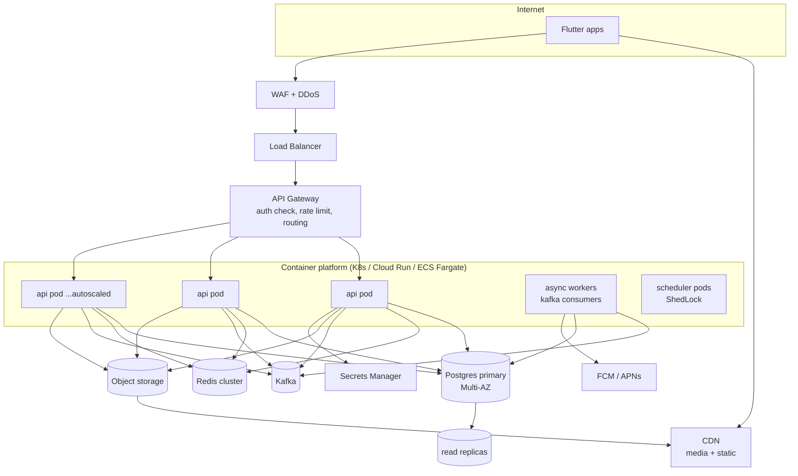
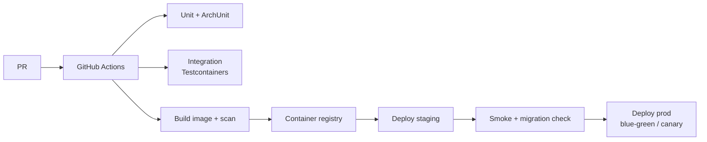

# 06 · Infrastructure, Scalability & Resilience

> Goal: **scalable and resilient** without over‑building before there are users.
> Everything here is sized for the phased posture — managed services first,
> horizontal scaling designed in, multi‑region deferred until it's needed.

## 1. Deployment topology

- **Stateless app pods** behind the gateway → scale horizontally with an HPA on
  CPU + p95 latency + queue lag. No session affinity needed (JWT + Redis).
- **Async workers** are the same image with a `worker` profile; scale on Kafka
  consumer lag independently of request traffic.
- **Scheduler** pods use ShedLock so cron‑style jobs fire once cluster‑wide.

### Recommended managed services (cloud‑agnostic; AWS / GCP examples)

| Need | AWS | GCP |
|---|---|---|
| Containers | ECS Fargate / EKS | Cloud Run / GKE |
| Postgres | RDS/Aurora PostgreSQL (Multi‑AZ) | Cloud SQL / AlloyDB |
| Redis | ElastiCache | Memorystore |
| Kafka | MSK (or SQS/SNS for MVP) | Managed Kafka / Pub/Sub |
| Object store + CDN | S3 + CloudFront | GCS + Cloud CDN |
| Secrets | Secrets Manager | Secret Manager |
| Push | (FCM + APNs directly) | FCM |

**MVP simplification:** Cloud Run / Fargate + managed Postgres + Redis +
SQS/Pub‑Sub (instead of Kafka) is a perfectly resilient starting point; swap to
Kafka when event volume and replay needs grow.

## 2. Scaling strategy (where load goes and how we absorb it)

| Hot path | Bottleneck | Scaling lever |
|---|---|---|
| Feed reads | DB + hydration | Redis page cache → fan‑out‑on‑write `feed_entries` → dedicated feed service |
| Workout/eval sync bursts | write throughput | idempotent writes, batch sample inserts, connection pooling (PgBouncer) |
| Coach dashboards | aggregate queries | denormalized `coach_athlete` + read replicas + cache |
| Search (food/people) | text scans | `tsvector` GIN → OpenSearch |
| Time‑series (HR/power) | row volume | TimescaleDB hypertables + retention/rollup |
| Push fan‑out | external API | async workers + batching + provider rate handling |
| Realtime/chat | long‑lived conns | WS gateway scaled separately, Redis pub/sub backplane |

**Read replicas** serve feed/profile/dashboard reads; writes go to primary.
**PgBouncer** keeps connection counts sane as pods scale.

## 3. Caching layers

1. **CDN** — media + any cacheable public assets.
2. **Redis** — hydrated feed pages (short TTL), profile aggregates, body‑metric
   series, exercise/food catalogs (long TTL), suggestion lists, rate‑limit
   counters, presence.
3. **HTTP caching** — `ETag`/`Cache-Control` on stable GETs (exercise catalog,
   public profiles) so the CDN/clients can revalidate cheaply.
4. **In‑app (Flutter)** — local Drift DB is the deepest cache (offline).

Cache invalidation is event‑driven: `WorkoutCompleted` busts the author's
profile/feed caches; `Followed` warms timelines.

## 4. Resilience patterns

| Pattern | Where | Tool |
|---|---|---|
| Timeouts on every outbound call | DB, Redis, FCM, OAuth, S3 | Resilience4j / client config |
| Retry w/ exponential backoff + jitter | transient failures, sync | Resilience4j; client outbox |
| Circuit breaker | external providers (push, OAuth, future Strava) | Resilience4j |
| Bulkhead / pool isolation | separate pools for critical vs best‑effort work | Resilience4j, separate thread pools |
| Idempotency | all client writes | `client_uuid` + `Idempotency-Key` |
| Transactional outbox | event publication | outbox table + relay |
| At‑least‑once + idempotent consumers | Kafka listeners keyed on event id | dedupe table / upsert |
| Dead‑letter queues | poison messages | DLQ topic + alert |
| Graceful degradation | feed falls back to DB if cache down; push fails ≠ save fails | design rule |
| Backpressure / rate limiting | gateway + per‑endpoint | gateway + bucket4j |
| Health checks & readiness | liveness/readiness probes | Spring Actuator |
| Graceful shutdown | drain in‑flight, finish consuming | Spring lifecycle |

**Resilience invariant:** a failure in a *secondary* concern (feed post, push,
analytics) must **never** fail a *primary* write (the workout/eval/message
itself). Primary write commits; secondary effects are async and retried.

## 5. High availability & disaster recovery

- **Multi‑AZ** for app pods, Postgres (sync standby), Redis (replica). Survives a
  zone loss with no data loss.
- **Backups:** automated daily snapshots + **PITR** (WAL) on Postgres; tested
  restores. Object storage versioned + cross‑region replication for media.
- **RPO/RTO targets (initial):** RPO ≤ 5 min (PITR), RTO ≤ 1 hour. Tighten later.
- **Multi‑region:** deferred. Seam is ready (stateless app, event log, object
  replication); add a read region + global DB when user geography demands it.

## 6. CI/CD

- **DB migrations** with Flyway run as a pre‑deploy step; **backward‑compatible
  migrations** (expand/contract) so blue‑green never breaks the old version.
- **Blue‑green or canary** deploys with automated rollback on error‑rate/latency
  SLO breach.
- **Mobile:** Flutter built in CI, distributed via TestFlight / Play Internal →
  staged rollout. API keeps **2‑version backward compatibility** because phones
  update slowly.
- Infrastructure as code (Terraform); secrets only via Secrets Manager, never in
  images or env files in the repo.

## 7. Observability

| Pillar | Stack | Key signals |
|---|---|---|
| Metrics | Micrometer → Prometheus → Grafana | p50/95/99 latency, error rate, DB pool, cache hit %, Kafka lag, queue depth |
| Tracing | OpenTelemetry → Tempo/Jaeger | end‑to‑end request + async trace propagation |
| Logging | structured JSON → Loki/ELK | correlation id per request, no PII/health values in logs |
| Errors | Sentry (backend + Flutter) | crash + exception grouping |
| Uptime/SLO | synthetic checks + alerting | availability, push delivery, sync success rate |
| Product | event analytics (consented) | activation, retention, feature use |

**SLOs (initial):** API availability 99.9%, read p95 < 300ms, write p95 < 600ms,
sync success > 99.5%, push delivery > 98%. Alert on burn‑rate, page on SLO breach.

## 8. Cost & right‑sizing

- Start small: 2–3 app pods, single Multi‑AZ Postgres, single Redis, managed
  queue. Autoscale on real signals.
- Time‑series retention + media lifecycle (cold storage for old exports) keep
  storage cost flat.
- Revisit Kafka, OpenSearch, dedicated feed service, and multi‑region **only on
  the triggers** in [08-roadmap](08-roadmap.md) — don't pay for them early.
