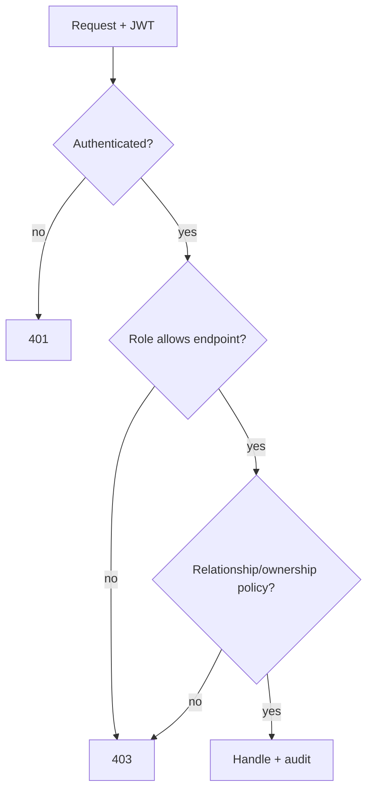

# 07 · Security & Privacy

> AthleteHub stores **special‑category personal data** — body weight, body‑fat,
> circumferences, skinfolds, progress photos, heart rate. Under GDPR (Art. 9)
> and similar laws this is health data and demands a higher bar than a typical
> social app. Privacy is a design constraint, not a feature.

## 1. Authentication

| Concern | Decision |
|---|---|
| Methods | Email + password, **Sign in with Apple**, **Google Sign‑In** (per design) |
| Tokens | Short‑lived **access JWT** (~15 min) + **rotating refresh token** (~30 days) |
| Refresh store | Server‑side (Redis + audit row) so tokens are **revocable**; rotation detects reuse → revoke family |
| Password hashing | **Argon2id** (or bcrypt cost ≥ 12) |
| OAuth | Verify Apple/Google identity token signatures + audience; link to `oauth_accounts` |
| Password reset | One‑time, short‑expiry, single‑use token; no account enumeration |
| MFA | Optional TOTP (Phase 2), enforced for coaches handling many athletes (Phase 3) |
| Session security | Cert pinning, device binding via `devices`, biometric app‑lock optional |

Spring Security as an **OAuth2 Resource Server** validates the JWT on every
request; the gateway does a cheap pre‑check, the app does authoritative checks.

## 2. Authorization

Two layers:

1. **RBAC** — roles `ATHLETE` and `COACH` (a user can hold both and switch).
   Coach‑only endpoints require the `COACH` role.
2. **Relationship / resource‑based (ReBAC)** — the real protection:
   - A coach may read/assign **only** to athletes with an `active` row in
     `coach_athlete` (and that link required the athlete's **consent**).
   - An athlete sees another user's evaluations/diet **never**; social posts only
     per `visibility` (public / followers / private).
   - A user mutates only their own training/body/diet data.

Enforced with method security `@PreAuthorize` + a policy service
(`canCoachAccess(coachId, athleteId)`), plus row‑level checks in queries. Every
denial is logged.

## 3. Consent model (coach ↔ athlete)

A coach **cannot** see an athlete's body data until the athlete accepts the
link. Flow: coach invites → athlete accepts (`POST /coach/invitations/{id}/
accept`) → relationship `active`. The athlete can **end the relationship** at any
time, which revokes the coach's access going forward. Coaches see only the data
scopes the athlete grants (training, body, diet — toggleable).

## 4. Data protection

| Control | Detail |
|---|---|
| In transit | TLS 1.2+ everywhere; HSTS; cert pinning on mobile |
| At rest | Disk encryption on Postgres/Redis/S3; **column/field encryption** for the most sensitive (photos keys, future health‑provider tokens) |
| Mobile at rest | SQLCipher‑encrypted Drift DB; tokens in Keychain/Keystore |
| Secrets | Secrets Manager; never in repo/images; provider tokens stored as **references** (`access_token_ref`), not values |
| Media access | Private buckets; time‑limited **signed URLs**; no public listing |
| PII in logs | Forbidden — no weights, body‑fat, emails, or photo URLs in logs; correlation ids only |
| Backups | Encrypted; same access controls; included in erasure runbook |

## 5. Privacy & compliance (GDPR‑first, portable to others)

- **Lawful basis & consent:** explicit consent for processing health data and
  for coach access; granular, withdrawable. Terms/Privacy acceptance captured at
  sign‑up (the design's "By continuing you agree…").
- **Data minimization:** collect only what a screen needs; analytics use
  pseudonymized ids and **exclude** biometric values.
- **Right to access / portability:** `GET` export → JSON/CSV bundle of a user's
  data (async, delivered as a signed download).
- **Right to erasure:** `DELETE /me` triggers an async erase that hard‑deletes
  evaluations, measurements, diary, photos, messages, devices and **anonymizes**
  authored posts/comments (so others' threads survive). Cascade documented in
  [02-data-model](02-data-model.md).
- **Data residency:** keep EU users' data in‑region if you market in the EU;
  the stateless app + per‑region storage seam supports this later.
- **Retention:** time‑series samples down‑sampled/retention‑capped; deleted
  accounts purged from backups on the next cycle per policy.
- **Minors:** fitness/diet for under‑16s is sensitive — gate age at sign‑up and
  require appropriate consent or block.

## 6. Application security (OWASP)

- Input validation (Bean Validation) on every DTO; reject unknown/oversized
  payloads at the gateway.
- Parameterized queries / JPA — no string‑built SQL; review native queries.
- Rate limiting + bot/abuse protection at the gateway; per‑user quotas on writes.
- File uploads: content‑type allow‑list, size caps, **AV/malware scan** before
  `ready`, strip EXIF/GPS from photos, never trust client‑declared type.
- Idempotency keys prevent duplicate‑submission abuse.
- CORS locked to known origins (mostly N/A for native, relevant for any web/BFF).
- Dependency scanning (Dependabot/Snyk), container image scanning, SBOM.
- Secrets rotation; least‑privilege IAM per service.
- If/when GraphQL lands: **query depth + cost limits**, disable introspection in
  prod, persisted queries.

## 7. Auditing & monitoring

- Audit log for: auth events, role switches, coach access grants/revocations,
  coach reads of athlete data, data exports, erasures, admin actions.
- Security alerting on: refresh‑token reuse, auth brute force, authz denials
  spikes, unusual export/erase volume.
- Incident response runbook + breach‑notification process (GDPR 72‑hour clock).

## 8. Threat model (top risks & mitigations)

| Threat | Mitigation |
|---|---|
| Account takeover | Argon2id, refresh rotation + reuse detection, optional MFA, anomaly alerts |
| Coach over‑reach (sees non‑clients) | ReBAC policy + row checks + audit on every access |
| Leaked progress photos | Private buckets, signed URLs, EXIF strip, field‑encrypted keys |
| Health data exfiltration | Least privilege, no PII in logs, export/erase auditing |
| Replay / duplicate writes from sync | Idempotency keys + `client_uuid` constraints |
| Scraping social graph / search | Rate limits, pagination caps, auth required |
| Malicious uploads | Type allow‑list, size caps, AV scan, sandboxed processing |
| DoS | WAF, gateway rate limits, autoscaling, circuit breakers, DLQs |
